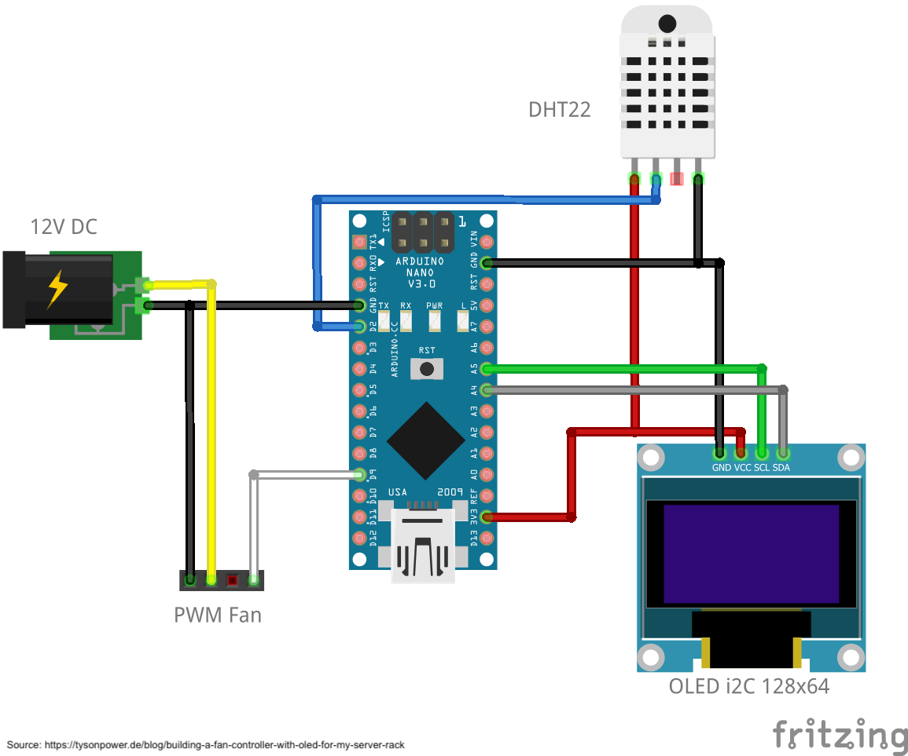

# Rack Fan Control

## Overview:

## Acknowledgment
These projects were used for inspiration:
- https://github.com/mariuste/Fan_Temp_Control
- https://tysonpower.de/blog/building-a-fan-controller-with-oled-for-my-server-rack
- https://www.instructables.com/Temperature-Control-With-Arduino-and-PWM-Fans/
- https://github.com/bonnee/fancontrol
